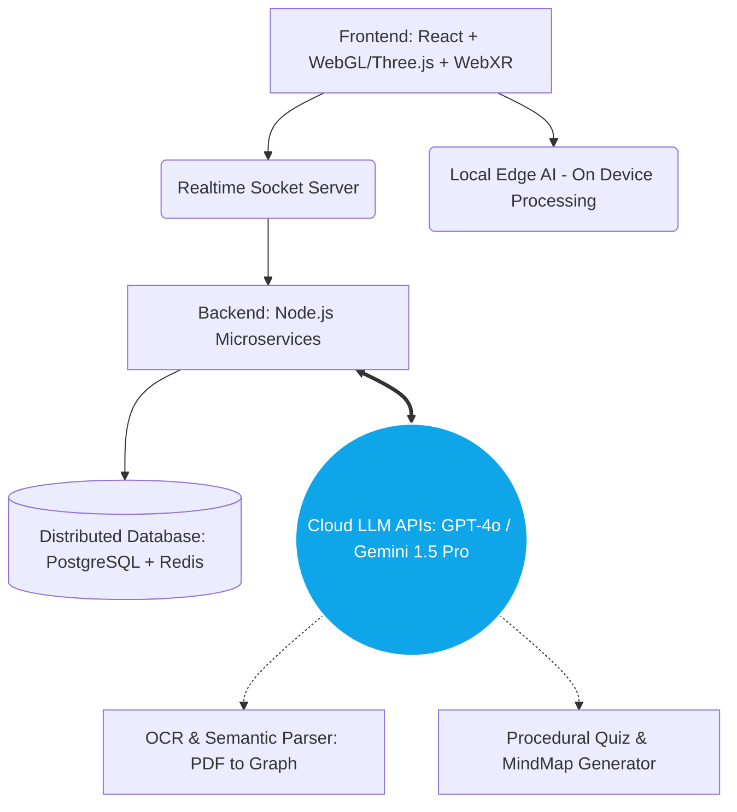

  
  # 🚀 ARKON
  **Augmented Reality Komputer Organizer**
  
  *Laboratorium CPU Personal Berbasis AI dan WebXR — Mengubah Abstraksi Menjadi Realitas.*
  
  
  
  

---

## 🛑 Kenapa ARKON Hadir? (The Problem)
Mata kuliah **Organisasi dan Arsitektur Komputer (OAK)** adalah salah satu mata kuliah yang paling dihindari. Konsep seperti *Pipeline Hazard*, *Cache Miss*, dan aliran *Data Bus* sangat abstrak dan sulit dibayangkan jika hanya diajarkan melalui **diagram 2D statis** di modul PDF.

Lebih buruk lagi, setiap dosen memiliki kurikulum yang kaku. Mahasiswa menjadi **pendengar pasif** tanpa bisa memvisualisasikan bagaimana sebuah instruksi benar-benar "mengalir" di dalam silikon.

## 🌟 Solusi: The Endgame Vision
ARKON **bukan** sekadar aplikasi buku digital 3D. ARKON adalah **Ekosistem Pedagogik Otonom** yang menghancurkan keterbatasan ruang dan waktu. Kami merancang ARKON sebagai gabungan dari **Augmented Reality (WebXR)** untuk visualisasi spasial absolut, dan **Generative AI (LLM)** sebagai otak tutor personal yang beradaptasi dengan kecepatan belajar setiap pengguna.

---

## ✨ Fitur Masa Depan (The Masterplan)

Jika dieksekusi secara maksimal, ARKON akan memiliki 4 pilar utama:

### 1. 👁️ Holographic Execution (Visualisasi Mutlak)
* **X-Ray CPU Vision:** Menggunakan Markerless AR. Mahasiswa dapat "membongkar" CPU di atas meja belajar mereka hanya dengan gestur tangan (Pinch & Zoom).
* **Top-Level Execution Flow:** Input kode Assembly (misal: `LOAD R1, R2`), lalu mainkan dalam "Slow-Mo". Lihat langsung aliran elektron (data) melintasi *Address Bus* ke RAM, ditarik ke *Instruction Register*, lalu dipecah oleh *Control Unit*.

### 2. 🧠 The Omniscient AI Parser (Otak Kurikulum)
* **Universal Ingestion:** Unggah (upload) buku teks tebal, PPT dosen, atau sekadar foto papan tulis. AI akan langsung merakit silabus dan mengaitkannya dengan model 3D AR secara instan tanpa perlu *hardcoding*.

### 3. 📝 The Intelligent Workspace
* **Neural Auto-Mindmap:** Ketik catatan Anda di dalam aplikasi. AI akan secara *real-time* menyusun teks Anda menjadi peta konsep (Mind Map) interaktif.
* **Generative Infinite Quiz:** Kuis tidak akan pernah sama. AI akan menciptakan soal secara prosedural berdasarkan kelemahan mahasiswa di sesi belajar saat itu.

### 4. 🌐 Multiplayer & Socratic AI Tutor
* **Shared AR Workspace:** Fitur kolaborasi. Cabut virtual RAM dari perangkat Anda, dan teman kelompok di kota lain akan melihat RAM tersebut dicabut di layar mereka.
* **Tutor AI Voice:** Chatbot yang bisa "melihat" apa yang Anda lihat di AR, siap menjawab pertanyaan kontekstual seperti, *"ARKON, kenapa PC nilainya bertambah padahal eksekusinya gagal?"*

---

## 🛠️ Tech Stack & Arsitektur (God Tier)

---

## 🎯 Roadmap Pengembangan (Menuju LIDM 2025)

- [x] **Fase 1: MVP (Minimum Viable Product)**
  - UI/UX Premium (*Glassmorphism*).
  - 12 Topik Modul Statis + Bank Kuis Lokal (120+ Variasi Soal).
  - Integrasi dasar A-Frame / AR.js Viewer.
- [ ] **Fase 2: Smarter ARKON (API AI)**
  - Integrasi LLM (Gemini/OpenAI) untuk Parser Modul (Upload PDF).
  - *Generative Quiz* dan implementasi *Auto-MindMap*.
- [ ] **Fase 3: The True 3D Workspace**
  - Peralihan ke *Markerless AR* (Surface Tracking).
  - Fitur *Top-Level Program Execution* yang dapat menerima input teks Assembly pengguna.
- [ ] **Fase 4: Endgame (Komersialisasi & Multiplayer)**
  - *Shared Workspace* untuk kolaborasi *real-time*.
  - Rilis B2B / SaaS untuk universitas di seluruh Indonesia.

---

  
<i>"Jika kita hanya membuat aplikasi visualisasi 3D, kita akan menjadi biasa saja. Tetapi dengan menggabungkan AR dan AI secara masif, kita mendemonstrasikan masa depan komputasi edukasi."</i>

  <b>— Tim Inovasi Teknologi Digital Pendidikan (ITDP) Universitas Negeri Semarang</b>

